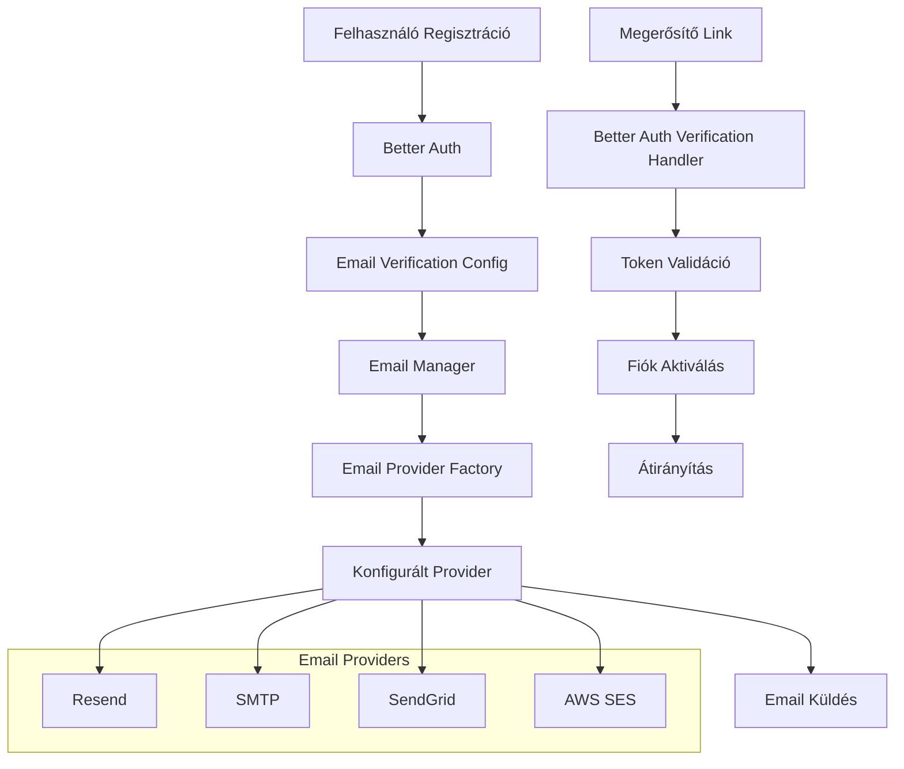

# Tervezési Dokumentum

## Áttekintés

Az email megerősítés funkció a Better Auth beépített email verification képességeit használja, integrálva a meglévő Email Manager rendszerrel. A megoldás minimális egyedi kód írását igényli, mivel a Better Auth már tartalmazza a szükséges funkcionalitást.

## Architektúra

### Komponens Diagram



## Komponensek és Interfészek

### 1. Better Auth Konfiguráció Módosítás

**Fájl:** `src/lib/auth/index.ts`

A meglévő Better Auth konfigurációt módosítani kell az email verification hozzáadásával:

````typescript
import { EmailManager } from '$lib/server/email/manager';
import { EmailTemplateType } from '$lib/server/email/types';

export const auth = betterAuth({
    // ... meglévő konfiguráció
    emailAndPassword: {
        enabled: true,
        requireEmailVerification: true, // false-ról true-ra változtatás
        disableSignUp: false
    },
    emailVerification: {
        sendVerificationEmail: async ({ user, url, token }, request) => {
            const emailManager = new EmailManager();

            const result = await emailManager.sendTemplatedEmail({
                to: user.email,
                template: EmailTemplateType.EMAIL_VERIFICATION,
                data: {
                    name: user.name || user.email.split('@')[0],
                    email: user.email,
                    verificationUrl: url,
                    token: token,
                    appName: 'Desktop Environment',
                    expirationTime: '24 óra'
                }
            });

            if (!result.success) {
                throw new Error('Email küldése sikertelen');
            }
        }
    },
    // ... többi konfiguráció
});

### 2. Email Sablon Hozzáadása

**Fájl:** `src/lib/server/email/types.ts`

Új email sablon típus hozzáadása:

```typescript
export enum EmailTemplateType {
    WELCOME = 'welcome',
    PASSWORD_RESET = 'password_reset',
    NOTIFICATION = 'notification',
    EMAIL_VERIFICATION = 'email_verification' // Új típus
}
````

**Fájl:** `src/lib/server/email/templates/built-in.ts`

Új email sablon implementáció:

```typescript
[EmailTemplateType.EMAIL_VERIFICATION]: {
    subject: 'Erősítsd meg az email címed - {{appName}}',
    htmlTemplate: `
        <!DOCTYPE html>
        <html>
        <head>
            <meta charset="utf-8">
            <meta name="viewport" content="width=device-width, initial-scale=1.0">
            <title>Email megerősítés - {{appName}}</title>
            <style>
                body {
                    font-family: -apple-system, BlinkMacSystemFont, 'Segoe UI', Roboto, Helvetica, Arial, sans-serif;
                    line-height: 1.6;
                    color: #333;
                    max-width: 600px;
                    margin: 0 auto;
                    padding: 20px;
                }
                .header {
                    text-align: center;
                    padding: 20px 0;
                    border-bottom: 2px solid #f0f0f0;
                    margin-bottom: 30px;
                }
                .logo {
                    font-size: 24px;
                    font-weight: bold;
                    color: #2563eb;
                }
                .content {
                    padding: 20px 0;
                }
                .cta-button {
                    display: inline-block;
                    background-color: #16a34a;
                    color: white;
                    padding: 12px 24px;
                    text-decoration: none;
                    border-radius: 6px;
                    margin: 20px 0;
                    font-weight: bold;
                }
                .footer {
                    margin-top: 40px;
                    padding-top: 20px;
                    border-top: 1px solid #e5e5e5;
                    font-size: 14px;
                    color: #666;
                    text-align: center;
                }
                .security-note {
                    background-color: #f3f4f6;
                    border-radius: 6px;
                    padding: 16px;
                    margin: 20px 0;
                    font-size: 14px;
                }
            </style>
        </head>
        <body>
            <div class="header">
                <div class="logo">{{appName}}</div>
            </div>

            <div class="content">
                <h1>Email cím megerősítése</h1>

                <p>
                    Szia {{name}}!
                </p>

                <p>
                    Köszönjük, hogy regisztráltál a {{appName}} rendszerbe. Az email címed megerősítéséhez kattints az alábbi gombra:
                </p>

                <p>
                    <a href="{{verificationUrl}}" class="cta-button">Email cím megerősítése</a>
                </p>

                <p>
                    Ha a gomb nem működik, másold be ezt a linket a böngésződbe:
                </p>

                <p style="word-break: break-all; background-color: #f9fafb; padding: 10px; border-radius: 4px;">
                    {{verificationUrl}}
                </p>

                <div class="security-note">
                    <strong>Fontos tudnivalók:</strong>
                    <ul>
                        <li>Ez a link {{expirationTime}} múlva lejár</li>
                        <li>Ha nem te regisztráltál, figyelmen kívül hagyhatod ezt az emailt</li>
                        <li>Soha ne oszd meg ezt a linket senkivel</li>
                    </ul>
                </div>

                <p>
                    Üdvözlettel,<br>
                    A {{appName}} csapata
                </p>
            </div>

            <div class="footer">
                <p>
                    Ez az email a {{email}} címre lett küldve.
                </p>
            </div>
        </body>
        </html>
    `,
    textTemplate: `
Email cím megerősítése - {{appName}}

Szia {{name}}!

Köszönjük, hogy regisztráltál a {{appName}} rendszerbe. Az email címed megerősítéséhez látogasd meg ezt a linket:

{{verificationUrl}}

Fontos tudnivalók:
- Ez a link {{expirationTime}} múlva lejár
- Ha nem te regisztráltál, figyelmen kívül hagyhatod ezt az emailt
- Soha ne oszd meg ezt a linket senkivel

Üdvözlettel,
A {{appName}} csapata

---
Ez az email a {{email}} címre lett küldve.
    `,
    requiredData: ['name', 'email', 'verificationUrl', 'appName'],
    optionalData: ['expirationTime']
}
```

### 3. API Végpontok

**Fájl:** `src/routes/api/auth/[...auth]/+server.ts`

A Better Auth automatikusan kezeli a következő végpontokat:

- `GET /api/auth/verify-email?token=...&callbackURL=...` - Email megerősítés
- `POST /api/auth/send-verification-email` - Újraküldés

A Better Auth automatikusan kezeli a következő végpontokat:

- `GET /api/auth/verify-email?token=...&callbackURL=...` - Email megerősítés
- `POST /api/auth/send-verification-email` - Újraküldés (body: { email, callbackURL })

### 4. Frontend Komponensek

**Fájl:** `src/routes/(auth)/verify-email/+page.svelte`

Email megerősítési oldal:

- Token validáció URL paraméterből
- Sikeres/sikertelen megerősítés kezelése
- Átirányítás bejelentkezési oldalra

**Fájl:** `src/routes/(auth)/resend-verification/+page.svelte`

Újraküldési oldal:

- Email cím bekérése
- Újraküldési kérés kezelése
- Rate limiting feedback

## Adatmodellek

### Meglévő Better Auth Táblák Használata

A Better Auth automatikusan kezeli a verification tokeneket a `verifications` táblában:

```sql
-- Már létező tábla a Better Auth által
CREATE TABLE verifications (
    id TEXT PRIMARY KEY,
    identifier TEXT NOT NULL,
    value TEXT NOT NULL,
    expires_at TIMESTAMP NOT NULL,
    created_at TIMESTAMP DEFAULT CURRENT_TIMESTAMP,
    updated_at TIMESTAMP DEFAULT CURRENT_TIMESTAMP
);
```

### Email Log Integráció

A meglévő `email_logs` tábla használata a megerősítő emailek naplózására.

## Hibakezelés

### 1. Email Küldési Hibák

```typescript
// Email Manager automatikusan kezeli
try {
    await emailManager.sendTemplatedEmail(params);
} catch (error) {
    // Naplózás és fallback logika
    logger.error('Email verification send failed', { error, email });
    throw new Error('Email küldése sikertelen');
}
```

### 2. Token Validációs Hibák

- Lejárt token kezelése
- Érvénytelen token kezelése
- Már használt token kezelése

### 3. Rate Limiting

Better Auth beépített rate limiting használata:

```typescript
rateLimit: {
    window: 60, // 1 perc
    max: 5 // Maximum 5 kísérlet percenként
}
```

## Tesztelési Stratégia

### 1. Unit Tesztek

- Email sablon renderelés tesztelése
- Token generálás és validáció tesztelése
- Email Manager integráció tesztelése

### 2. Integrációs Tesztek

- Teljes regisztrációs folyamat tesztelése
- Email küldés és fogadás tesztelése
- Megerősítési link működésének tesztelése

### 3. E2E Tesztek

- Felhasználói regisztráció és megerősítés
- Újraküldési funkció tesztelése
- Hibakezelési forgatókönyvek

### 4. Fejlesztői Környezet

```typescript
// Test mode konfiguráció
emailAndPassword: {
    enabled: true,
    requireEmailVerification: true,
    sendEmail: async (email, url, token) => {
        if (env.NODE_ENV === 'development') {
            console.log('DEV: Email verification link:', url);
        }
        // Email Manager test mode használata
        return await emailManager.sendTemplatedEmail({
            to: email,
            template: EmailTemplateType.EMAIL_VERIFICATION,
            data: { email, verificationUrl: url, token, appName: config.APP_NAME }
        });
    }
}
```

## Biztonsági Megfontolások

### 1. Token Biztonság

- Kriptográfiailag biztonságos token generálás (Better Auth által)
- 24 órás lejárati idő
- Egyszeri használat (Better Auth által kezelve)

### 2. Rate Limiting

- Email újraküldés korlátozása
- IP alapú korlátozás
- Felhasználó alapú korlátozás

### 3. Email Biztonság

- HTTPS kényszerítés megerősítő linkekben
- Email cím validáció
- Spam védelem

## Konfigurációs Beállítások

### Environment Változók

```bash
# Meglévő email konfigurációk használata
EMAIL_PROVIDER=resend
RESEND_API_KEY=re_...
RESEND_FROM_EMAIL=noreply@example.com

# Better Auth konfigurációk
BETTER_AUTH_SECRET=...
BETTER_AUTH_URL=http://localhost:5173
```

### Alkalmazás Konfiguráció

```typescript
// src/lib/config.ts
export const config = {
    APP_NAME: 'Desktop Environment',
    EMAIL_VERIFICATION_EXPIRES_IN: 60 * 60 * 24, // 24 óra
    VERIFICATION_REDIRECT_URL: '/auth/signin'
};
```

## Teljesítmény Optimalizáció

### 1. Email Küldés

- Aszinkron email küldés
- Queue rendszer használata nagy forgalom esetén
- Email provider failover

### 2. Token Kezelés

- Memória cache használata gyakori token ellenőrzésekhez
- Automatikus cleanup lejárt tokenekhez

### 3. Adatbázis Optimalizáció

- Index használata verification táblán
- Automatikus cleanup job lejárt rekordokhoz

## Monitoring és Naplózás

### 1. Email Metrikák

- Küldött megerősítő emailek száma
- Sikeres megerősítések aránya
- Email küldési hibák

### 2. Felhasználói Metrikák

- Regisztrációs konverziós ráta
- Megerősítési idő átlaga
- Újraküldési kérések száma

### 3. Hibakövetés

- Email küldési hibák naplózása
- Token validációs hibák
- Rate limiting események
