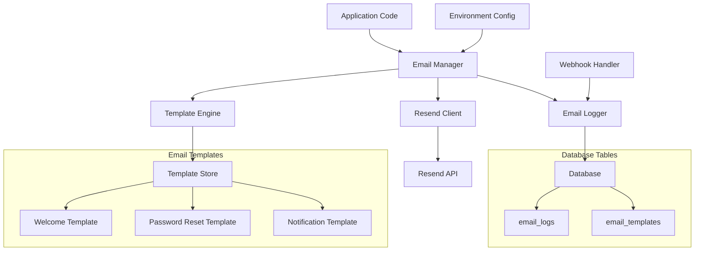
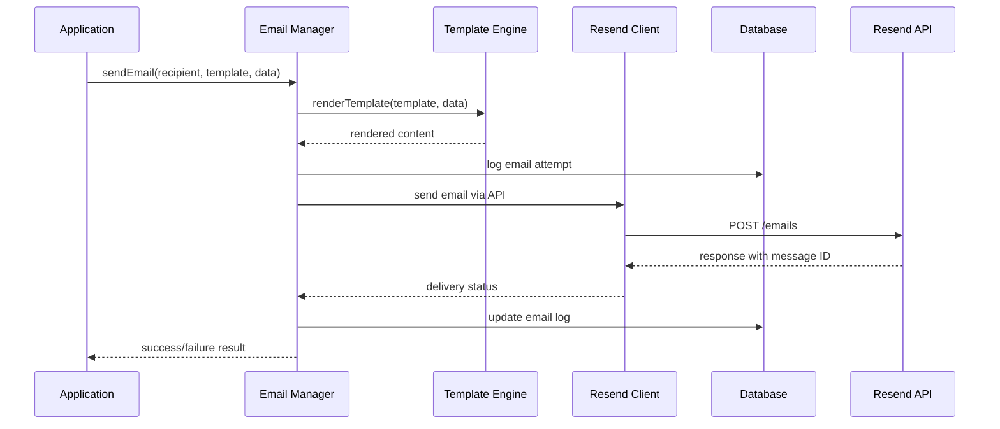

# Design Document - Resend Email Integration

## Overview

This design document outlines the integration of Resend email service into the desktop environment web application. The solution provides a robust, type-safe email delivery system that supports transactional emails, template management, and comprehensive logging while maintaining the existing architectural patterns of the application.

The integration follows the established patterns in the codebase using TypeScript, Valibot for validation, Drizzle ORM for data persistence, and maintains separation between server-side utilities and client-side services.

## Architecture

### High-Level Architecture



### Component Interaction Flow



## Components and Interfaces

### 1. Email Manager (`src/lib/server/email/manager.ts`)

Core service responsible for orchestrating email operations.

```typescript
interface EmailManager {
  sendEmail(params: SendEmailParams): Promise<EmailResult>
  sendTemplatedEmail(params: TemplatedEmailParams): Promise<EmailResult>
  getEmailStatus(messageId: string): Promise<EmailStatus>
  validateConfiguration(): Promise<boolean>
}

interface SendEmailParams {
  to: string | string[]
  subject: string
  html?: string
  text?: string
  from?: string
  replyTo?: string
  attachments?: EmailAttachment[]
}

interface TemplatedEmailParams {
  to: string | string[]
  template: EmailTemplateType
  data: Record<string, unknown>
  from?: string
  replyTo?: string
}

interface EmailResult {
  success: boolean
  messageId?: string
  error?: string
}
```

### 2. Resend Client (`src/lib/server/email/client.ts`)

Wrapper around Resend API with error handling and retry logic.

```typescript
interface ResendClient {
  send(email: ResendEmailPayload): Promise<ResendResponse>
  validateApiKey(): Promise<boolean>
  handleWebhook(payload: ResendWebhookPayload): Promise<void>
}

interface ResendEmailPayload {
  from: string
  to: string[]
  subject: string
  html?: string
  text?: string
  reply_to?: string
  attachments?: ResendAttachment[]
}
```

### 3. Template Engine (`src/lib/server/email/templates/engine.ts`)

Handles email template rendering with dynamic data substitution.

```typescript
interface TemplateEngine {
  render(template: EmailTemplateType, data: Record<string, unknown>): Promise<RenderedTemplate>
  registerTemplate(type: EmailTemplateType, template: EmailTemplate): void
  validateTemplateData(template: EmailTemplateType, data: Record<string, unknown>): boolean
}

interface RenderedTemplate {
  subject: string
  html: string
  text: string
}

interface EmailTemplate {
  subject: string
  htmlTemplate: string
  textTemplate: string
  requiredData: string[]
  optionalData?: string[]
}
```

### 4. Email Logger (`src/lib/server/email/logger.ts`)

Manages email delivery logging and status tracking.

```typescript
interface EmailLogger {
  logEmailAttempt(params: EmailLogParams): Promise<string>
  updateEmailStatus(logId: string, status: EmailDeliveryStatus): Promise<void>
  getEmailLogs(filters: EmailLogFilters): Promise<EmailLog[]>
}

interface EmailLogParams {
  recipient: string
  subject: string
  template?: EmailTemplateType
  messageId?: string
  status: EmailDeliveryStatus
}
```

## Data Models

### Database Schema Extensions

```sql
-- Email delivery logs
CREATE TABLE email_logs (
  id UUID PRIMARY KEY DEFAULT gen_random_uuid(),
  message_id VARCHAR(255),
  recipient VARCHAR(255) NOT NULL,
  subject VARCHAR(500) NOT NULL,
  template_type VARCHAR(100),
  status VARCHAR(50) NOT NULL,
  error_message TEXT,
  sent_at TIMESTAMP WITH TIME ZONE DEFAULT NOW(),
  delivered_at TIMESTAMP WITH TIME ZONE,
  opened_at TIMESTAMP WITH TIME ZONE,
  clicked_at TIMESTAMP WITH TIME ZONE,
  created_at TIMESTAMP WITH TIME ZONE DEFAULT NOW(),
  updated_at TIMESTAMP WITH TIME ZONE DEFAULT NOW()
);

-- Email templates (optional for custom templates)
CREATE TABLE email_templates (
  id UUID PRIMARY KEY DEFAULT gen_random_uuid(),
  type VARCHAR(100) UNIQUE NOT NULL,
  name VARCHAR(255) NOT NULL,
  subject_template TEXT NOT NULL,
  html_template TEXT NOT NULL,
  text_template TEXT NOT NULL,
  required_data JSONB NOT NULL DEFAULT '[]',
  optional_data JSONB DEFAULT '[]',
  is_active BOOLEAN DEFAULT true,
  created_at TIMESTAMP WITH TIME ZONE DEFAULT NOW(),
  updated_at TIMESTAMP WITH TIME ZONE DEFAULT NOW()
);
```

### Drizzle Schema Definitions

```typescript
// src/lib/server/database/schemas/platform/email/email_logs.ts
export const emailLogs = pgTable('email_logs', {
  id: uuid('id').primaryKey().defaultRandom(),
  messageId: varchar('message_id', { length: 255 }),
  recipient: varchar('recipient', { length: 255 }).notNull(),
  subject: varchar('subject', { length: 500 }).notNull(),
  templateType: varchar('template_type', { length: 100 }),
  status: varchar('status', { length: 50 }).notNull(),
  errorMessage: text('error_message'),
  sentAt: timestamp('sent_at', { withTimezone: true }).defaultNow(),
  deliveredAt: timestamp('delivered_at', { withTimezone: true }),
  openedAt: timestamp('opened_at', { withTimezone: true }),
  clickedAt: timestamp('clicked_at', { withTimezone: true }),
  createdAt: timestamp('created_at', { withTimezone: true }).defaultNow(),
  updatedAt: timestamp('updated_at', { withTimezone: true }).defaultNow()
});
```

## Error Handling

### Error Types and Recovery Strategies

```typescript
enum EmailErrorType {
  CONFIGURATION_ERROR = 'configuration_error',
  VALIDATION_ERROR = 'validation_error',
  API_ERROR = 'api_error',
  TEMPLATE_ERROR = 'template_error',
  RATE_LIMIT_ERROR = 'rate_limit_error'
}

interface EmailError {
  type: EmailErrorType
  message: string
  retryable: boolean
  retryAfter?: number
}
```

### Retry Logic

- **Rate Limiting**: Exponential backoff with jitter (1s, 2s, 4s, 8s, 16s)
- **API Errors**: Retry 5xx errors, fail immediately on 4xx errors
- **Network Errors**: Retry with exponential backoff up to 3 attempts
- **Template Errors**: No retry, immediate failure with detailed error message

## Testing Strategy

### Unit Tests

- **Email Manager**: Test email sending, template rendering, error handling
- **Resend Client**: Mock API responses, test retry logic, webhook handling
- **Template Engine**: Test template rendering, data validation, error cases
- **Email Logger**: Test database operations, status updates, filtering

### Integration Tests

- **End-to-End Email Flow**: Test complete email sending process
- **Webhook Processing**: Test delivery status updates
- **Configuration Validation**: Test environment setup and API key validation
- **Database Operations**: Test email logging and retrieval

### Test Environment Setup

```typescript
// Test configuration
const testEmailConfig = {
  apiKey: 'test_key',
  fromEmail: 'test@example.com',
  testMode: true,
  captureEmails: true,
  logLevel: 'debug'
}
```

## Configuration Management

### Environment Variables

```typescript
// Extended env.ts schema
const envSchema = v.object({
  // ... existing variables
  RESEND_API_KEY: v.string(),
  RESEND_FROM_EMAIL: v.string(),
  RESEND_WEBHOOK_SECRET: v.optional(v.string()),
  EMAIL_TEST_MODE: v.optional(v.pipe(
    v.string(),
    v.transform((s) => s === 'true')
  )),
  EMAIL_LOG_LEVEL: v.optional(v.picklist(['debug', 'info', 'warn', 'error']))
});
```

### Configuration Validation

```typescript
interface EmailConfig {
  apiKey: string
  fromEmail: string
  webhookSecret?: string
  testMode: boolean
  logLevel: 'debug' | 'info' | 'warn' | 'error'
  retryAttempts: number
  retryDelay: number
}
```

## Security Considerations

### API Key Management

- Store Resend API key in environment variables only
- Never expose API key in client-side code or logs
- Validate API key format and permissions on startup

### Email Content Security

- Sanitize all user-provided content in templates
- Validate email addresses using proper regex patterns
- Prevent email header injection attacks
- Rate limit email sending per user/IP

### Webhook Security

- Verify webhook signatures using Resend webhook secret
- Validate webhook payload structure
- Implement idempotency for webhook processing
- Log all webhook attempts for audit purposes

## Performance Considerations

### Async Processing

- Use background job processing for bulk emails
- Implement email queuing for high-volume scenarios
- Cache rendered templates to reduce processing time

### Database Optimization

- Index email_logs table on recipient, status, and created_at
- Implement log rotation for old email records
- Use database connection pooling for concurrent operations

### Monitoring and Metrics

- Track email delivery rates and failure reasons
- Monitor API response times and error rates
- Set up alerts for configuration issues or high failure rates

## Deployment Considerations

### Environment Setup

- Development: Use test mode with email capture
- Staging: Use real API with limited sending quotas
- Production: Full configuration with monitoring and alerting

### Migration Strategy

- Create database tables using Drizzle migrations
- Seed initial email templates
- Validate configuration in each environment
- Test webhook endpoints before going live
