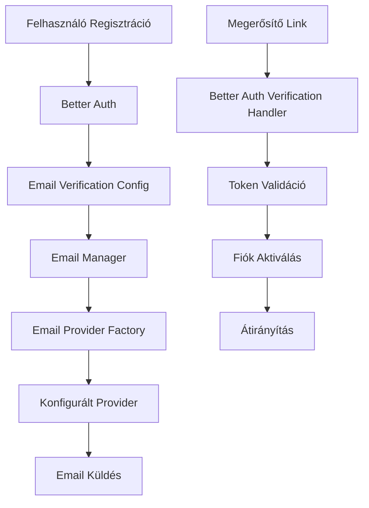

# Email Megerősítés Funkció

## Áttekintés

Az email megerősítés funkció biztosítja, hogy a felhasználók valós email címekkel regisztráljanak az alkalmazásba. A funkció a Better Auth beépített email verification képességeit használja, integrálva a meglévő Email Manager rendszerrel.

## Főbb Funkciók

- **Automatikus email küldés** regisztráció után
- **Biztonságos token alapú megerősítés** 24 órás lejárati idővel
- **Újraküldési lehetőség** rate limiting védelemmel
- **Többnyelvű támogatás** (magyar)
- **Rugalmas email szolgáltató integráció** (Resend, SMTP, SendGrid, AWS SES)

## Architektúra

### Komponensek



### Fájl Struktúra

```
src/lib/auth/
├── index.ts                    # Better Auth konfiguráció
└── __tests__/
    ├── email-verification-simple.test.ts
    └── email-verification-integration.test.ts

src/lib/server/email/
├── templates/
│   ├── built-in.ts            # Email sablonok
│   └── __tests__/
│       └── email-verification.test.ts
└── types.ts                   # Email típusok

src/routes/
├── verify-email/
│   └── +page.svelte          # Megerősítési oldal
└── resend-verification/
    └── +page.svelte          # Újraküldési oldal

tests/e2e/
└── email-verification.spec.ts # E2E tesztek
```

## Konfiguráció

### Environment Változók

#### Alapvető Beállítások

```env
# Email Verification Beállítások
REQUIRE_EMAIL_VERIFICATION=true
EMAIL_VERIFICATION_EXPIRES_IN=86400  # 24 óra másodpercben
AUTO_SIGNIN_AFTER_VERIFICATION=false

# Better Auth Konfiguráció
BETTER_AUTH_SECRET=your_32_character_secret_key
BETTER_AUTH_URL=http://localhost:5173

# Email Szolgáltató Konfiguráció
EMAIL_PROVIDER=resend  # resend, smtp, sendgrid, ses
```

#### Email Szolgáltató Specifikus Beállítások

**Resend (Ajánlott):**

```env
EMAIL_PROVIDER=resend
RESEND_API_KEY=re_your_resend_api_key
RESEND_FROM_EMAIL=noreply@yourdomain.com
RESEND_VERIFIED_EMAIL=your@email.com
```

**SMTP (Gmail, Outlook):**

```env
EMAIL_PROVIDER=smtp
SMTP_HOST=smtp.gmail.com
SMTP_PORT=587
SMTP_SECURE=false
SMTP_USERNAME=your@gmail.com
SMTP_PASSWORD=your_16_char_app_password
```

**SendGrid:**

```env
EMAIL_PROVIDER=sendgrid
SENDGRID_API_KEY=SG.your_sendgrid_api_key
SENDGRID_FROM_EMAIL=noreply@yourdomain.com
```

**AWS SES:**

```env
EMAIL_PROVIDER=ses
AWS_REGION=us-east-1
AWS_ACCESS_KEY_ID=your_access_key
AWS_SECRET_ACCESS_KEY=your_secret_key
```

#### Fejlesztői Beállítások

```env
# Fejlesztői Mód
NODE_ENV=development
EMAIL_TEST_MODE=true          # Teszt mód - emailek nem kerülnek elküldésre
EMAIL_LOG_LEVEL=debug         # Részletes naplózás

# Feature Flag-ek
VERIFICATION_FEATURE_ENABLED=true
VERIFICATION_NEW_USERS_ONLY=false
VERIFICATION_ROLLOUT_PERCENTAGE=100
```

### Better Auth Konfiguráció

A `src/lib/auth/index.ts` fájlban:

```typescript
export const auth = betterAuth({
    emailAndPassword: {
        enabled: true,
        requireEmailVerification: true,  // Email megerősítés kötelező
        disableSignUp: false
    },
    emailVerification: {
        sendVerificationEmail: async ({ user, url, token }) => {
            const emailManager = new EmailManager();

            const result = await emailManager.sendTemplatedEmail({
                to: user.email,
                template: EmailTemplateType.EMAIL_VERIFICATION,
                data: {
                    name: user.name || user.email.split('@')[0],
                    email: user.email,
                    verificationUrl: url,
                    token: token,
                    appName: 'Desktop Environment',
                    expirationTime: '24 óra'
                }
            });

            if (!result.success) {
                throw new Error('Email küldése sikertelen');
            }
        }
    }
});
```

## Email Sablon

### Sablon Adatok

A megerősítő email a következő adatokat használja:

```typescript
interface EmailVerificationData {
    name: string;              // Felhasználó neve
    email: string;             // Felhasználó email címe
    verificationUrl: string;   // Megerősítő link
    token: string;             // Biztonsági token
    appName: string;           // Alkalmazás neve
    expirationTime?: string;   // Lejárati idő (opcionális)
}
```

### Sablon Tartalom

A sablon tartalmazza:

- **Személyre szabott üdvözlést** a felhasználó nevével
- **Egyértelmű megerősítő gombot** kiemelkedő stílussal
- **Alternatív linket** ha a gomb nem működik
- **Biztonsági figyelmeztetéseket** magyar nyelven
- **Lejárati információt** (24 óra)
- **Responsive design-t** minden eszközön

## API Végpontok

A Better Auth automatikusan biztosítja a következő végpontokat:

### Email Megerősítés

```
GET /api/auth/verify-email?token=TOKEN&callbackURL=URL
```

**Paraméterek:**

- `token`: Megerősítő token (kötelező)
- `callbackURL`: Átirányítási URL sikeres megerősítés után (opcionális)

**Válaszok:**

- `200`: Sikeres megerősítés - átirányítás
- `400`: Érvénytelen vagy lejárt token
- `404`: Token nem található

### Email Újraküldés

```
POST /api/auth/send-verification-email
Content-Type: application/json

{
    "email": "user@example.com",
    "callbackURL": "/dashboard"
}
```

**Válaszok:**

- `200`: Email sikeresen elküldve
- `400`: Érvénytelen email cím
- `429`: Túl sok kérés (rate limiting)
- `404`: Felhasználó nem található

## Frontend Komponensek

### Megerősítési Oldal (`/verify-email`)

```svelte
<!-- src/routes/verify-email/+page.svelte -->
<script lang="ts">
	import { page } from '$app/stores';
	import { onMount } from 'svelte';

	let status: 'loading' | 'success' | 'error' = 'loading';
	let message = '';

	onMount(async () => {
		const token = $page.url.searchParams.get('token');

		if (!token) {
			status = 'error';
			message = 'Hiányzó megerősítő token';
			return;
		}

		try {
			const response = await fetch(`/api/auth/verify-email?token=${token}`);

			if (response.ok) {
				status = 'success';
				message = 'Email cím sikeresen megerősítve!';
				// Átirányítás 3 másodperc után
				setTimeout(() => {
					window.location.href = '/auth/signin';
				}, 3000);
			} else {
				status = 'error';
				message = 'Érvénytelen vagy lejárt megerősítő link';
			}
		} catch (error) {
			status = 'error';
			message = 'Hiba történt a megerősítés során';
		}
	});
</script>
```

### Újraküldési Oldal (`/resend-verification`)

```svelte
<!-- src/routes/resend-verification/+page.svelte -->
<script lang="ts">
	let email = '';
	let status: 'idle' | 'loading' | 'success' | 'error' = 'idle';
	let message = '';

	async function resendEmail() {
		if (!email) return;

		status = 'loading';

		try {
			const response = await fetch('/api/auth/send-verification-email', {
				method: 'POST',
				headers: { 'Content-Type': 'application/json' },
				body: JSON.stringify({ email })
			});

			if (response.ok) {
				status = 'success';
				message = 'Megerősítő email elküldve!';
			} else {
				status = 'error';
				message = 'Hiba történt az email küldése során';
			}
		} catch (error) {
			status = 'error';
			message = 'Hálózati hiba történt';
		}
	}
</script>
```

## Biztonsági Megfontolások

### Token Biztonság

- **Kriptográfiailag biztonságos** token generálás
- **24 órás lejárati idő** automatikus cleanup-pal
- **Egyszeri használat** - token érvénytelenítés használat után
- **Brute force védelem** rate limiting-gel

### Rate Limiting

```typescript
// Better Auth beépített rate limiting
rateLimit: {
    window: 60,    // 1 perc ablak
    max: 5         // Maximum 5 kísérlet percenként
}
```

### Email Biztonság

- **HTTPS kényszerítés** minden megerősítő linkben
- **Email cím validáció** regisztráció előtt
- **Spam védelem** rate limiting és CAPTCHA-val
- **Phishing védelem** domain ellenőrzéssel

## Hibakezelés

### Email Küldési Hibák

```typescript
try {
    await emailManager.sendTemplatedEmail(params);
} catch (error) {
    // Részletes naplózás
    logger.error('Email verification send failed', {
        error: error.message,
        email: user.email,
        timestamp: new Date().toISOString()
    });

    // Felhasználóbarát hibaüzenet
    throw new Error('Email küldése sikertelen. Kérjük próbálja újra később.');
}
```

### Token Validációs Hibák

- **Lejárt token**: "A megerősítő link lejárt. Kérjen új linket."
- **Érvénytelen token**: "Érvénytelen megerősítő link."
- **Már használt token**: "Ez a link már fel lett használva."
- **Hiányzó token**: "Hiányzó megerősítő token."

### Hálózati Hibák

- **Kapcsolat hiba**: Automatikus újrapróbálkozás 3x
- **Timeout**: 30 másodperces timeout beállítás
- **DNS hiba**: Alternatív email szolgáltató használata

## Tesztelés

### Unit Tesztek

```bash
# Email sablon tesztek
bun test src/lib/server/email/templates/__tests__/email-verification.test.ts

# Better Auth integráció tesztek
bun test src/lib/auth/__tests__/email-verification-simple.test.ts
bun test src/lib/auth/__tests__/email-verification-integration.test.ts
```

### E2E Tesztek

```bash
# Teljes regisztrációs és megerősítési folyamat
bun test:e2e tests/e2e/email-verification.spec.ts
```

### Manuális Tesztelés

#### Fejlesztői Környezetben

1. **Regisztráció tesztelése:**

   ```bash
   # EMAIL_TEST_MODE=true esetén
   # Konzolban megjelenik a megerősítő link
   ```

2. **Email szolgáltató tesztelése:**
   ```bash
   # Teszt email küldése
   curl -X POST http://localhost:5173/api/auth/send-verification-email \
     -H "Content-Type: application/json" \
     -d '{"email":"test@example.com"}'
   ```

#### Éles Környezetben

1. **Resend Dashboard ellenőrzése**
2. **Email delivery metrikák figyelése**
3. **Hibakezelés tesztelése** érvénytelen tokenekkel

## Monitoring és Naplózás

### Metrikák

- **Küldött megerősítő emailek száma** (napi/heti/havi)
- **Sikeres megerősítések aránya** (konverziós ráta)
- **Email küldési hibák száma** és típusa
- **Átlagos megerősítési idő**
- **Újraküldési kérések száma**

### Naplózás

```typescript
// Email küldés naplózása
logger.info('Email verification sent', {
    userId: user.id,
    email: user.email,
    provider: emailProvider,
    timestamp: new Date().toISOString()
});

// Megerősítés naplózása
logger.info('Email verified successfully', {
    userId: user.id,
    email: user.email,
    verificationTime: Date.now() - registrationTime,
    timestamp: new Date().toISOString()
});
```

### Riasztások

- **Email küldési hiba ráta > 5%**
- **Megerősítési ráta < 50%**
- **Rate limiting túllépések**
- **Email szolgáltató elérhetetlenség**

## Teljesítmény Optimalizáció

### Email Küldés

- **Aszinkron feldolgozás** queue rendszerrel
- **Batch küldés** nagy volumen esetén
- **Connection pooling** SMTP kapcsolatokhoz
- **Retry mechanizmus** exponenciális backoff-fal

### Adatbázis

- **Indexek** a verifications táblán:

  ```sql
  CREATE INDEX idx_verifications_identifier ON verifications(identifier);
  CREATE INDEX idx_verifications_expires_at ON verifications(expires_at);
  ```

- **Automatikus cleanup** lejárt tokenekhez:
  ```sql
  DELETE FROM verifications WHERE expires_at < NOW();
  ```

### Cache

- **Redis cache** gyakori token ellenőrzésekhez
- **Memory cache** email sablonokhoz
- **CDN** statikus email assets-ekhez

## Hibaelhárítás

### Gyakori Problémák

#### "Email nem érkezik meg"

1. **Ellenőrizd a spam mappát**
2. **EMAIL_TEST_MODE=false** beállítás
3. **Email szolgáltató konfiguráció** ellenőrzése
4. **From email domain** verifikálása

#### "Érvénytelen token hiba"

1. **Token lejárati idő** ellenőrzése
2. **URL encoding** problémák
3. **Adatbázis kapcsolat** ellenőrzése
4. **Better Auth konfiguráció** validálása

#### "Rate limiting hibák"

1. **Rate limit beállítások** módosítása
2. **IP whitelist** hozzáadása fejlesztéshez
3. **User-based limiting** implementálása

### Debug Módok

```env
# Részletes naplózás
EMAIL_LOG_LEVEL=debug
BETTER_AUTH_DEBUG=true

# Teszt mód
EMAIL_TEST_MODE=true
NODE_ENV=development
```

### Támogatott Böngészők

- **Chrome/Chromium** 90+
- **Firefox** 88+
- **Safari** 14+
- **Edge** 90+

## Jövőbeli Fejlesztések

### Rövid Távú (1-3 hónap)

- [ ] **Többnyelvű email sablonok** (angol, német)
- [ ] **Email delivery tracking** webhook-okkal
- [ ] **Advanced rate limiting** IP és user alapon
- [ ] **Email template editor** admin felületen

### Hosszú Távú (3-12 hónap)

- [ ] **A/B testing** email sablonokhoz
- [ ] **Email analytics dashboard**
- [ ] **Custom domain support** email címekhez
- [ ] **SMS verification** alternatívaként
- [ ] **Social login** email verification bypass

## Támogatás és Dokumentáció

### Hasznos Linkek

- [Better Auth Dokumentáció](https://better-auth.com/docs)
- [Email Provider Beállítások](./email-providers.md)
- [Resend API Dokumentáció](https://resend.com/docs)
- [SMTP Konfiguráció Útmutató](../gmail-smtp-setup.md)

### Kapcsolat

Ha problémába ütközöl az email verification funkcióval:

1. **Ellenőrizd a dokumentációt** és FAQ-t
2. **Nézd meg a logokat** részletes hibaüzenetekért
3. **Teszteld a konfigurációt** fejlesztői környezetben
4. **Nyiss issue-t** a projekt repository-ban

---

_Utolsó frissítés: 2024. október_
